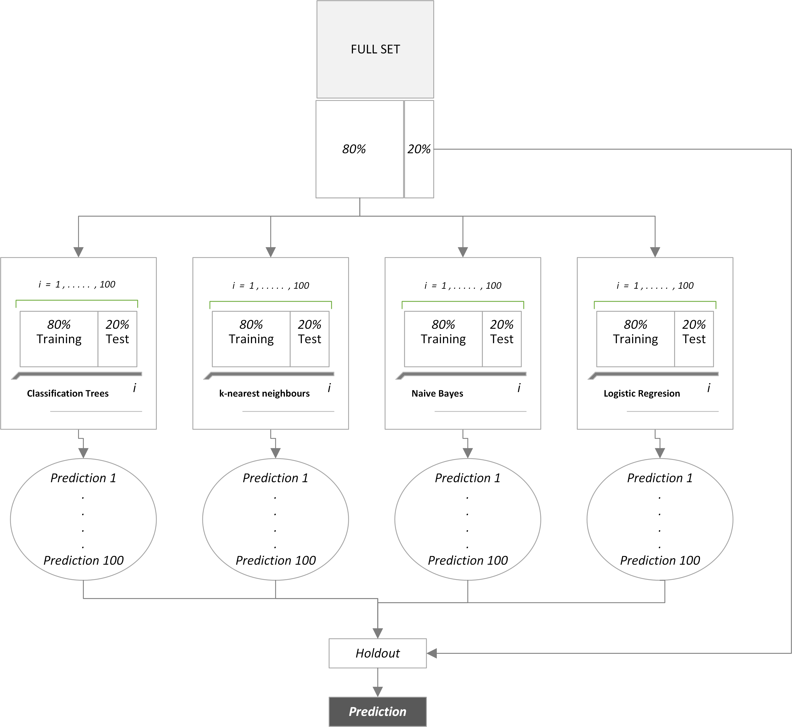

```{r setup, include=FALSE}
knitr::opts_chunk$set(echo = TRUE)
htmltools::tagList(rmarkdown::html_dependency_font_awesome())
# package rquirements
source("packages.R")
masterRaw <- readRDS("../data/masterRaw.RDS")
master <- readRDS("../data/master.RDS")
fits <- readRDS("results/imputationComps.RDS")
library(magrittr)
library(data.table)
```

### Table of contents <a name="contents"></a>

* [How to run this analysis](#instructions)

  + [The `data` folder](#data_folder)

* [The hygiene hypothesis mechanism](#mechanism)

* [Data](#data)

  + [Data exploration](#dataexplr)
  + [Imputation](#imput)

* [Methodology](#methodology)

  + [Ensemble learning](#ensemble)
  + [Parameters](#parameters)
  
* [Results](#results)
  
### How to run this analysis <a name="instructions"></a>

<span class="warning"><i class="fas fa-exclamation-triangle"></i> You may be asked to install certain packages. The program will not run if you decline installation.</span>

First, set the working directory by specifying the path of the folder <em>project2</em>. This can be done in <em>R Studio</em> by typing on the console:
```{r include=TRUE, eval=FALSE}
path <- "PATH/TO/project2"
setwd(path)
getwd() # should show "PATH/TO/project2". Note that "PATH/TO" is the rest of the path of project2.
```

You can also open the project file <em>project2.Rproj</em>, this automatically sets the working directory in your `R` session to the project's folder. 

#### The `data` folder <a name="data_folder"></a>

This folder `data` contains the necessary scripts to download, unpack and consolidate the NHIS data:

```{r echo=FALSE, eval=TRUE, include=TRUE}
fs::dir_tree(path = "../data")
```

The main script is `data/processData.R`. By running this program, a file called `master.RDS` should be saved in the folder. This file is used in the machine learning exercise. 


### The hygiene hypothesis mechanism <a name="mechanism"></a>

Humans have been living with parasites and other microbes inside their bodies (mostly in the digestive system) since the beginning of mankind. In the context of evolution, the immune system adapted itself to internal parasites in such a way that, for instance, many of them were "allowed" to coexist internally. At the same time, external threats that cause infectious diseases also helped shape the immunoregulatory response to infectious agents that cause allergies and autoimmune diseases. After World War II, humans experienced a sharp improvement in their general health and sanitary conditions. This resulted in the removal of many of these parasites and microbes from their microbiota (i.e. the set of external agents living in the human body) in a very short time-span. Given that evolution is a slow process, these sudden changes might have left the immunological system unbalanced.

Atopies and autoimmune disorders are essentially overreactions triggered by the immune system. These overreactions are associated with a high level of T helper cells release. For autoimmune diseases, T helper type 1 cells are unusually high. Atopies on the other hand, are prompted by high levels of T helper type 2 cells released by the immunoregulatory system. T regulatory cells that are used to regulate the release of helper cells are absent on children raised in a highly sanitized environment. Therefore researchers have concluded that children who are exposed to a less diverse microbial environment might develop an unbalanced and/or insensitive autoimmune system --which is associated with unnecessarily high levels of both type 1 and 2 T helper cells.

### Data <a name="data"></a>

We use the [2016](https://www.cdc.gov/nchs/nhis/nhis_2016_data_release.htm) and [2017](https://www.cdc.gov/nchs/nhis/nhis_2017_data_release.htm) National Health Interview Survey (NHIS) samples in this project. 

Each year contains a set of samples for the following groups:

* sample child
* sample adult
* sample persons
* sample family

Because some of the features are parent-related, we identify which children in the sample child file is actually the child of an adult in the adult sample. This is possible through a unique family and household identification keys, and the sample persons file. The sample persons dataset contains both sample child and sample adult individuals. The sample persons file may contain multiple members of a household but it assigns a "reference person" flag. All the other members of the household in the sample persons have labels based on their relationship to the reference person in their household. Using this information, we can filter for these children with a child-parent relationship to the reference person in their household. Not every child in the sample child file is tagged as the reference person child. For this reason, our dataset is smaller than the full set of individuals in both sample child file. Some caveats: 

- We don't know whether the child is biologically related to the parent;
- We only have information for one of the parents;

Our final data has `r nrow(master)` observations. In the data manipulation step, we excluded 139 observations because they have `NA` values across all the columns selected for analysis. Below is a list of variables used in this analysis:

```{r echo=FALSE, eval=TRUE}
tab <- readRDS("tables/descriptions.RDS")
kableExtra::kable(tab, format = "html", booktabs=TRUE, caption = "Description of variables in the dataset") %>% 
  kableExtra::kable_styling(full_width = TRUE) %>% 
  kableExtra::column_spec(1, bold = TRUE) %>% 
  kableExtra::column_spec(column = c(2:3), width = "30em")
rm(tab)
```

For the machine learning application, we grouped the variables pertaining autoimmune diseases into a single column. This a binnary variable with `1` indicating the presence of one or more of autoimmune conditions and `0` otherwise. We do the same for the parents. It is important to note that for all default "Yes"/"No" type variables (binnary) those __respondents who answered "Not ascertained" or "Don't know" are assigned the baseline value `0`__.

Additionally, we binnarized the following variables: `REGION`, `RACERPI2`, `FM_KIDS`(no. of children in the child's family) and `INCGRP5` (income bracket) with the baseline group as the lowest code originally assigned in the sample --e.g. number of kids equals to 1 is ommited in the matrix.

#### Data exploration <a name="dataexpl"></a>


```{r echo=FALSE, eval=TRUE}
tab_b <- readRDS("tables/descriptions_f.RDS")
kableExtra::kable(tab_b, format = "html", booktabs=TRUE, caption = "Description of variables in the dataset 2") %>% 
  kableExtra::kable_styling(full_width = TRUE) %>% 
  kableExtra::column_spec(1, bold = TRUE) %>% 
  kableExtra::column_spec(column = c(2:3), width = "30em")
rm(tab_b)
```


We begin to explore the data by looking at the prevalence of autoimmune diseases by age in the figure below. It seems that autoimmune diseases has a sudden increase by age 2. This may coincide with routine check-ups for 2-year old toddlers. It is also well known that some allergies tend to disappear after age 2. We can see that as the percentage dips at age 3 but it starts to rise again peaking at age 11 perhaps due to hormonal effects in puberty.


```{r ageauto, fig.cap="Percentage of children with an auotimmune disease by age", echo=FALSE}
readRDS("figures/age_autoimmune.RDS")
``` 

Not surprisingly, children from parents who have an autoimmune disease are more likaly to have similar condition. It is a stark difference. It is also possible that this difference can be partially explained by the fact that parents with an autoimmune disease know the subtleties of a particular condition which in turn it is helpful to seek treatment (e.g. autoimmune diseases have a range of severity and symptoms may be subtle enough to go unnoticed).

```{r parentauto, fig.cap="Parents with one or more autoimmune diseases are more likely to have children with one or more autoimmune diseases", echo=FALSE}
readRDS("figures/parent_autoimmune.RDS")
``` 

Central to the hygiene hypothesis is the fact that children tend to exchange more germs when they come into contact with other children. Therefore, the more children in the family, the higher is the germ exchange and the more calibrated the immune system is. The graph below shows the percentage of children in the sample who have an autoimmune disease by number of siblings (plus the child itself). It is an interesting graph for the hygiene hypothesis given that the percentage trends down as the number of siblings increase. Again, this is no proof, of course, but it does lend itself to some interesting speculation.

```{r kidsauto, fig.cap="Number of children in the family seems to be negatively correlated with the prevalence of autoimmune diseases for the sampled child", echo=FALSE}
readRDS("figures/kids_autoimmune.RDS")
``` 

A more dismaying picture for the hypothesis is shown belown. According to the hypothesis, children from lower income backgrounds are less likely to develop allergies for instance because of a less sanitized environment (presumably). The graph below shows that this may not be the case. The highest frequency of the children who have an autoimmune disease is found in the lowest brackets.

```{r incomeauto, fig.cap="The percentage of children with an autoimmune disease by bracketed family income", echo=FALSE}
readRDS("figures/income_autoimmune.RDS")
``` 


#### Imputation <a name="imput"></a>

We noticed that values grater than 5485 grams in the  _Child's weigth at birth_ variable are censored. However, values that are coded as 9997, 9998 and 9999 are labelled as "Refused", "Not ascertained" or "Don't know" respectively. For these particular instances --there are `r masterRaw[BWTGRM_P > 5485, .N]` observations in total -- we used imputation methods to infer their values. More specifically, multivariate imputation by chained equations (MICE) via the [`mice`](https://cran.r-project.org/web/packages/mice/index.html) package.

The imputation method of choice was a linear regression ignoring model error, so there is no stochastic component in the imputted values. The number of imputations was set to 50 for 50 different iterations. The child's age, region (binnarized), race (binnarized) and the child's age were used to produce the imputted values. 

Looking at the regression coefficients of a simple linear regression model of the type `lm(BWTGRM_P ~ AGE_P +  DEV_BORN + REGION_2 + REGION_3 + REGION_4 + RACERPI2_2 + RACERPI2_3 + RACERPI2_4 + RACERPI2_5 + RACERPI2_6)` shows that the coefficients varied little after the imputation results: 

```{r echo=FALSE, eval=TRUE}
# without imputted values
fits[[1]]
# with imputted values
fits[[2]]
```

We understand the limitation of this process as a less-than-ideal method. Especially given the covariates used in the imputation step (mostly binnary variables). But most importantly, this serves as a template for future and more robust applications during the data preparation step.

### Methodology <a name="methodology"></a>

We use an ensemble learning method to predict whether a child has an autoimmune disease. It comrpises of four main model categories: logistic, naive bayes, k-nearest neighbours and classification trees. A holdout set is created before we start to run the models. The table below shows the outcome variable's composition for each of the sets in this analysis:

```{r echo=FALSE, eval=TRUE}
tab <- readRDS("tables/setSplits.RDS")
kableExtra::kable(tab, format = "html", booktabs=TRUE, caption = "Outcome variable's split is very similar across sets") %>% 
  kableExtra::kable_styling(full_width = TRUE) %>% 
  kableExtra::column_spec(1, bold = TRUE)
rm(tab)
```

The full set is the all the data collected for this exercise and the remaining set is what is left after we sampled a holdout set.

#### Ensemble learning <a name="ensemble"></a>

The ensemble learning method for this exercise has the following steps:

1. There are 400 distinct pairs of samples with 80/20 training-test sets splits from the remaining set --that is, the anti join result of the full set and the holdout set;

2. These 400 pairs of samples are divided into 4 groups of 100 each and assigned to one of the four models;

3. 100 models are run for each model type (KNN, classification trees, naive bayes and logistic), each run has a different train-test split sampled and different parameter values --e.g. see [Parameters](#parameters) section;

4. The predictions outputs do not assign a class but rather probabilities `predict(..., type='prob')`. We use these probabilities as parameters in a random generation function for the binomial distribution;

5. We then calculate the Matthews correlation coefficient[^mcc] (MCC) and the true positive rate[^tpr] (TPR) for each model and generate weights based on the following metric: $\text{w}_i = \text{TPR}_i \times \text{MCC}_i \space \space \forall \space \space \text{MCC} \ge \space 0$.[^metricformula] The weighting design is an attempt to give extra importance to the accuracy of positive cases --i.e. child has an autoimmune disease;

6. The holdout set is used to predict the outcome variable for each model generated and the probabilities are weighted by the values described in 5;

7. Similar to (4), instead of an arbitrary boundary, we use the resulting weighted probabilities as parameters in a random generation function for the binomial distribution.

```{r echo=FALSE, eval=TRUE, fig.cap="Ensemble learning diagram"}

```


#### Parameters <a name="parameters"></a>

We let parameters to vary for each of the four general models used in the ensemble learning. The parameters are listed in the table below. Each parameter is randomly selected.

```{r echo=FALSE, eval=TRUE}
tab <- readRDS("tables/paramsTab.RDS")
kableExtra::kable(tab, format = "html", booktabs=TRUE, caption = "Parameters allowed to vary for each general model") %>% kableExtra::kable_styling(full_width = TRUE) %>% 
  kableExtra::column_spec(column = c(2), width = "30em")
rm(tab)
```


### Results <a name="results"></a>

The ensemble learning code is in the script `project_analysis\model_training\ensemble_train.R`. The results are fully reproducible. `models.RDS` is a list object with the trained models per general model.

```{r echo=FALSE,eval=TRUE}
fs::dir_tree("model_training")
```

You can also load the resulting prediction for the holdout set directly with `prediction_res.RDS`:

```{r echo=FALSE,eval=TRUE}
fs::dir_tree("results")
```

A way to visualize how the set of models performed on their test test is to plot the MCC and TPR. By the metric shown on the figure below, the ensemble of models from Naïve Bayes seems to have performed better as a whole compared to the other alternatives. The other three types of models are more or less bunched together with an MCC varying from negative to about 0.10. It is possible to note that the next best solution appears to be KNN models as the green points seem to be more prevalent in the right side of the bunching.  

```{r modelsper, fig.cap="MCC and TPR metrics for each trained model. Models with $\\text{MCC} \\lt 0$ are excluded", echo=FALSE}
readRDS("figures/mcc_tpr_models.RDS")
``` 

We have decided to exclude those models with a negative MCC score. The reason is simple, although we want to have as many models as possible, negative values for MCC suggests that the model accuracy is, so to speak, inverted --i.e. positive is negative and negative is positve. This defeats the purpose of our exercise, so we exclude those models. We end up with 353 "valid" models for prediction.

The next step is to use the remaining 353 trained models to predict the holdout set. The predictions are then weighted as described in the [Ensemble learning](#ensemble) section. The table below shows the confusion matrix for the __ensemble__ prediction:

```{r echo=FALSE, eval=TRUE}
tab <- readRDS("tables/table_pred.RDS")
kableExtra::kable(tab, booktabs = TRUE, format = "html", caption = "Holdout set prediction confusion matrix", 
                  align = "cc") %>% kableExtra::kable_styling(full_width = TRUE)
rm(tab)
```


The figure below shows the __ensemble__ predictions __vis-à-vis__ the ones from the trained models. The red triangle represents the final prediction. The TPR rate is close to 40% and the MCC is about 0.09. This comes as no surprise since the prediction generating process comes from the trained models. Even with relative higher weights given to those models with higher TPR values, the "lower performing" models are more numeours which holds back the performence of the holdout set predictions.

```{r predsper, fig.cap="__Ensemble__ prediction accuracy performance relative to trained models", echo=FALSE}
readRDS("figures/pred_mcc_tpr_comp.RDS")
``` 

There could be many concurrent explanation for the relative poor peformance of the ensemble learning model. First, data is definitely an issue. We would like to add more variables such as premature birth, wether the child is the oldest/middle/youngest, whether the child lives in a rural area and so forth. Additionally, one cannot rule out the possibility that the higyiene hypothesis does not hold out. There could also be more models to explore --e.g. deep learning algorithms.


[^mcc]: $\text{MCC} = \frac{TP \times TN - FP \times FN}{\sqrt{(TP + FP)(TP + FN)(TN + FP)(TN+FN)}}$, where $TP$: true positives; $TN$: true negatives; $FP$: false positives; $FN$: false negatives. $\text{MCC} \in [-1,1]$, the closer to 1, the better the overall prediction is, the closer to -1, the more disagreement there is between actual and predicted value. $\text{MCC}\to 0$ means the predictions approach a coin flip.
[^tpr]: $\text{TPR}=\frac{TP}{TP + FN}$. See definitions in the MCC footnote.
[^metricformula]: This implies that models with a negative MCC are excluded from the final prediction.