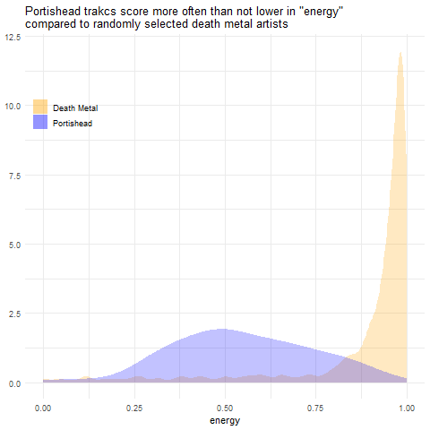
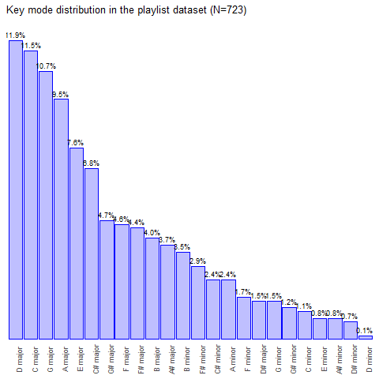

Clustering Exercise with Spotify Data
================

## `data` folder

The `data` folder contains all the steps necessary to reproduce the data
pulling and transformation step in this project.

We use the package [`spotifyr`](https://github.com/charlie86/spotifyr)
to pull audio features from playlists. `spotifyr` allows the pulling of
audio features data from [Spotify’s Web
API](https://developer.spotify.com/documentation/web-api/). To reproduce
this analysis, make sure you already have (or create) a spotify account.
Then proceed to access spotify developer
[dashboard](https://developer.spotify.com/dashboard/) to create a client
ID and secret which you need for authentication. Once you create these
two, click on the item created by this new client ID and copy both
client ID and secret. Then on the same application page, click on edit
settings and add `http://localhost:1410/` in the “Redirect URls” field
like so:


The script
[`./data/process_data.R`](https://github.com/jdemello/mat4376/blob/master/project3/data/process_data.R)
is the main function used to pull and manipulate the data to its final
format. Before you starting pulling the data, certify that `spotifyr` is
installed:

``` r
# check pkg requirement ----
if(!nzchar(system.file(package = "spotifyr"))){
  ans <- menu(choices = c("Y", "N"),
              title = "Package spotifyr not installed in your system.\n\nDo you wish to install it? (The function will thrown an error if 'N')")
  if(ans == 2L) stop("Execution aborted.")
  devtools::install_github('charlie86/spotifyr')
}
```

Note that you can’t run `process_data.R` without providing your client
ID and secret. Make sure you replace the `x`s in `process_data.R` with
the client ID and client secret respectively. Then execute the command
`spotifyr::get_spotify_authorization_code()` to exchange the
authorization code for the token and to create a file named
`.httr-oauth` in the current working directory. This file caches the
token so then next time you want to pull data from spotify’s API you
don’t need to go through the code-for-token exchange process (assuming
`.httr-oauth` is located in your current working directory).

``` r
# get your client ID and secret as per instructions -----
spotify_client_id = "xxxxxxxxxxxxxxxxxxxxxxxxxxxx" # paste client id
spotify_client_secret = "xxxxxxxxxxxxxxxxxxxxxxxxxxxx" # paste secret 

spotifyr::get_spotify_authorization_code()
```

Once you are done with this process, you are ready to start pulling the
data. Running `process_data.R` may require you to install some packages
along the wa. A dynamic menu will appear on your `R` console. If you
choose not to install these packages, the data replication process will
not be successful. We saved the transformed dataset in `data/data.RDS`
in case you wish not to go through the data replication process.

## Data description and transformation

`process_data.R` uses two ancillary functions: `consolidateData()` and
`binarize()`. In `consolidateData()`, we pull audio features from an
user’s playlist, delete some columns and add a label for the user name
from which the playlist’s information is being pulled. Then we proceed
to use `binarize()` which transforms some of the audio features in
binary variables with multiple columns (if more than two categories).
`binarize()` also **scales** some features into values ranging from 0 to
1. Scaling is necessary because clustering techniques use distance
metrics (in our project, the euclidean distance). See which features are
scaled [here](#features_desc).

We aggregate audio features from three playlists:

  - Ceasr’s playlist [“Created in
    R”](https://open.spotify.com/user/csarvi/playlist/5G9vRqFcPFUGBI7VxiQ2pX?si=OyN2TNZeR8KHH-GyC1wQFg)

  - Jose’s playlist [“Power/jangle
    pop”](https://open.spotify.com/user/12186384264/playlist/4kxFwuecMKs0Ax2Uif1Cwk?si=MCXs8oAJQ_OT0GHmoKbHDw);

  - Maia’s playlist [“favs
    extended”](https://open.spotify.com/user/melizabethp/playlist/0BxdQxq9vaDAEo5IXyr6E6?si=Qw2cakpnSCqCBHka98_paA).

<a name="features_desc">Below is a list of audio features included in
this exercise[\[1\]](#link_features):</a>

  - `acousticness`: spotify doesn’t provide many details but this is a
    confidence measure varying from `0.0` to `1.0` with `1.0`
    representing high confidence the track is acoustic.

  - `danceability`: how suitable a a track is for dance based on a
    combination of tempo, rhythm stability, beat strength and overall
    regularity. `0.0` is least danceable, `1.0` most danceable;

  - `duration_ms`: track duration in milliseconds (ms);

  - `energy`: how intense the track is. For instance, a death metal
    tracks have more “energy” than a typical Portishead song (*see
    below*)[\[2\]](#figures_script);



  - `instrumentalness`: also varying between `0.0` and `1.0`. Tracks
    approaching `1.0` are likely to contain NO vocal content.

  - `key`: the track’s key (F, E, C\#, etc.). This variable is
    **binarized**, keys become columns with an ommited (baseline) key
    –in this project, the baseline is the A key.

  - `mode`: the modality of the track (major or minor). This feature is
    *binarized* as `mode_minor` – major mode is baseline;

  - `key_mode`: the combination of `key` and `mode` (e.g. E major). This
    feature is *binarized* with baseline `key_mode_A major`;

  - `liveness`: this feature detects the presence of an audience in the
    track. Values vary from `0.0` to `1.0` (likely the track is live);

  - `loudness`: the values in decibels (dB) averaged across the track.
    `loudness` is scaled to range between 0 and 1;

  - `speechiness`: this feature measures the presence of spoken words in
    a track. It ranges from `0.0` to `1.0`, the lower the score, the
    less relative spoken words the track has;

  - `tempo`: the overall tempo of a track in beats per minute (BPM).
    This feature is scaled to fit in the `0.0` - `1.0` range.

  - `time_signature`: an integer defining the overal time signature of a
    track. This feature is scaled to values between `0.0` and `1.0`.

  - `valence`: this is a score between `0.0` and `1.0` measuring the
    musical positiveness. Tracks closer to `1.0` tend to be more joyful.
    For instance, Nirvana’s soundtracks tend to be more sad, darker than
    the punk rock band The Offspring.


For convenience, we saved the data in
[raw](https://github.com/jdemello/mat4376/blob/master/project3/data/raw.RDS)
and
[processed](https://github.com/jdemello/mat4376/blob/master/project3/data/data.RDS)
formats (before/after binarization). After using `binarize()`, we end up
with 46 audio features ad 722 tracks. Here is a list of the audio
features used in the clustering exercise:

    ##  [1] "danceability"          "energy"               
    ##  [3] "loudness"              "speechiness"          
    ##  [5] "acousticness"          "instrumentalness"     
    ##  [7] "liveness"              "valence"              
    ##  [9] "tempo"                 "duration_ms"          
    ## [11] "time_signature"        "key_Asharp"           
    ## [13] "key_B"                 "key_C"                
    ## [15] "key_Csharp"            "key_D"                
    ## [17] "key_Dsharp"            "key_E"                
    ## [19] "key_F"                 "key_Fsharp"           
    ## [21] "key_G"                 "key_Gsharp"           
    ## [23] "mode_minor"            "key_mode_A_minor"     
    ## [25] "key_mode_Asharp_major" "key_mode_Asharp_minor"
    ## [27] "key_mode_B_major"      "key_mode_B_minor"     
    ## [29] "key_mode_C_major"      "key_mode_C_minor"     
    ## [31] "key_mode_Csharp_major" "key_mode_Csharp_minor"
    ## [33] "key_mode_D_major"      "key_mode_D_minor"     
    ## [35] "key_mode_Dsharp_major" "key_mode_Dsharp_minor"
    ## [37] "key_mode_E_major"      "key_mode_E_minor"     
    ## [39] "key_mode_F_major"      "key_mode_F_minor"     
    ## [41] "key_mode_Fsharp_major" "key_mode_Fsharp_minor"
    ## [43] "key_mode_G_major"      "key_mode_G_minor"     
    ## [45] "key_mode_Gsharp_major" "key_mode_Gsharp_minor"

Here is a summary for some
    columns:

    ##   track_name        artist_name         danceability        energy      
    ##  Length:722         Length:722         Min.   :0.0961   Min.   :0.0442  
    ##  Class :character   Class :character   1st Qu.:0.4103   1st Qu.:0.5695  
    ##  Mode  :character   Mode  :character   Median :0.5180   Median :0.7370  
    ##                                        Mean   :0.5132   Mean   :0.6929  
    ##                                        3rd Qu.:0.6098   3rd Qu.:0.8538  
    ##                                        Max.   :0.9670   Max.   :0.9980  
    ##     loudness       speechiness       acousticness      
    ##  Min.   :0.0000   Min.   :0.02350   Min.   :0.0000032  
    ##  1st Qu.:0.6572   1st Qu.:0.03170   1st Qu.:0.0048025  
    ##  Median :0.7494   Median :0.03895   Median :0.0387500  
    ##  Mean   :0.7212   Mean   :0.05788   Mean   :0.1706681  
    ##  3rd Qu.:0.8216   3rd Qu.:0.06200   3rd Qu.:0.2522500  
    ##  Max.   :1.0000   Max.   :0.48500   Max.   :0.9740000  
    ##  instrumentalness       liveness         valence           tempo       
    ##  Min.   :0.0000000   Min.   :0.0243   Min.   :0.0332   Min.   :0.0000  
    ##  1st Qu.:0.0000000   1st Qu.:0.0975   1st Qu.:0.3063   1st Qu.:0.3499  
    ##  Median :0.0001555   Median :0.1315   Median :0.4835   Median :0.4664  
    ##  Mean   :0.0723056   Mean   :0.1925   Mean   :0.4895   Mean   :0.4793  
    ##  3rd Qu.:0.0184750   3rd Qu.:0.2525   3rd Qu.:0.6663   3rd Qu.:0.5913  
    ##  Max.   :0.9130000   Max.   :0.9890   Max.   :0.9660   Max.   :1.0000  
    ##   duration_ms     time_signature    user_name           mode_minor    
    ##  Min.   :0.0000   Min.   :0.0000   Length:722         Min.   :0.0000  
    ##  1st Qu.:0.1570   1st Qu.:0.7500   Class :character   1st Qu.:0.0000  
    ##  Median :0.2003   Median :0.7500   Mode  :character   Median :0.0000  
    ##  Mean   :0.2110   Mean   :0.7334                      Mean   :0.1898  
    ##  3rd Qu.:0.2438   3rd Qu.:0.7500                      3rd Qu.:0.0000  
    ##  Max.   :1.0000   Max.   :1.0000                      Max.   :1.0000

We can see for instance that approximately 20% of the tracks are in
minor mode (`mode_minor`).

As for the keys, instead, we use the unprocessed raw data to get an idea
of how these keys are distributed:



It is interesting to see that all major keys are ahead of minor ones
(except for `D# major`). `D major` is the most popular key mode followed
closely by `C major`. As for minors, `B minor` appears in the front with
3.5% of the observations. The least popular key mode is `D minor`.

## Data analysis

Before starting clustering, one may want to analyze similarities,
dissimilarities of the playlists comprising the dataset.

## Clustering

1.  <a name="link_features">Detail of the full list of audio features
    provided by the API:
    <https://developer.spotify.com/documentation/web-api/reference/tracks/get-several-audio-features/>.</a>

2.  <a name="figures_script">See the file
    [`figures.R`](https://github.com/jdemello/mat4376/blob/master/project3/img/figures.R)
    to replicate the charst shown in this project.</a>
